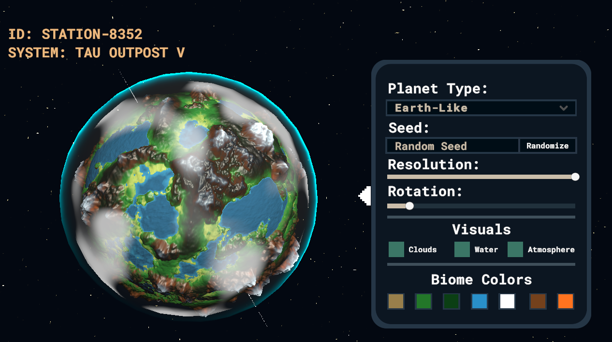

# Procedural Terrain Generation
This project used Unity to develop procedurally generated spherical planets using fractral perlin noise, custom mesh generation and dynamic shader in order to create realistic biomes and smooth variations based on varying world seeds.
## Project
>[](https://arccreate.github.io/proceduralGenerationBuild/)
Try It Yourself ^^


### Core Features
1)  `Five Distinct Planet Archetypes`
      - **Earth - Like**: Mountains typically form contiguous, dome like uplifts concentrated toward continental interiors, while lower amplitude noise layers flatten out terrain near shorelines, resulting in wide coastal plains. Transition zones between elevations are gradual, supporting a varied terrain profile without harsh discontinuities. Land is dominant and large water regions are more lake-esque than large oceans.  
       
      - **Mars - Like**: Has no water or clouds. The mountains are more slim and extreme with most of them having ice covered peaks, they form mountain ranges spanning the entire planet and theres a quick dropoff between mountainous regions and flatter terrain.
      - **Ice World**: Terrain is characterized by medium frequency noise with strong vertical amplification. Elevation is evenly distributed across the surface, resulting in a rolling, windswept topology with pervasive steep hills and limited flat zones. Unlike Earth or Mars, there are few large scale features and no dominant ranges or major valleys, just relentless elevation changes with near random distribution.  
       
      - **Volcanic World**: Has no water or clouds and color pallete resmebles one of a planet engulfed in volcanoes and lava. Volcanoes are other considerably tall relative to surrounging regions and have an extrmeely wide base. Flat regions are few and often can be seen between valleys of differeing volcanoe bases.       
      
      - **Ocean - World**: Built from a noise profile heavily biased toward negative elevation, leading to a majority ocean coverage. Islands form from rare positive spikes in the base noise layer and are constrained in both height and spread by limiting vertical scale and amplitude across all layers. As a result, landforms remain low and isolated, with hilly terrain that gently rises from sea level and lacks any extended mountain systems.
  
2) World generation is fully deterministic and driven by **user-input seeds**, which control the offset and phase shift of each terrain layer. This ensures that each unique seed yields a distinct planetary layout, including terrain shape, biome distribution, and elevation profile. <u>Seeds support alphnumeric and symbolic inputs.</u>
3) <u>Low resolution meshes offer rapid previews</u>, while higher subdivisions create high fidelity terrains with smoother normals and more detailed geometry. Resolution settings directly affect vertex count and mesh granularity, impacting both terrain sharpness and performance.
4) **Physics based Water Shader** which implements a custom Shader Graph using the `Fresnel effect` to simulate light refraction and reflectance across a dynamic water surface. Ocean depth is also accounted for giving shorelines a more prominent look while deep oceans are darker and vast.

## Terrain Generation on Plane
### Fractral Perlin Noise
**What is Perlin Noise?** Perlin Noise is a type of gradient noise used extensively in procedural content generation due to its smooth, coherent nature. Unlike uniform or white noise, where values are completely uncorrelated, Perlin Noise produces gradual transitions between values, making it ideal for terrain generation. However, a single layer of Perlin Noise produces overly smooth results unsuitable for realistic terrain with rugged features. To enhance complexity and realism, `Fractal Noise` is used: this is achieved by layering multiple octaves of Perlin Noise.
| Parameter    | Description                                                                 |
|--------------|-----------------------------------------------------------------------------|
| `scale`      | Controls zoom level into the noise pattern. Smaller = finer features.       |
| `octaves`    | Number of noise layers stacked to form fractal noise. More = more detail.   |
| `persistence`| Controls how amplitude decays per octave. Lower = less high-frequency impact.|
| `lacunarity` | Controls how frequency grows per octave. Higher = finer details per layer.  |
| `seed`       | Determines the pseudorandom offsets. Same seed = reproducible map.          |
| `offset`     | Shifts the entire noise map in 2D space (used for dynamic scrolling).       |

---
 

> By tuning these values, a wide variety of terrain types can be created from smooth rolling plains to jagged mountain ranges.
---

### **Mesh Generation**
  1. **Base HeightMap Creation**. The first step involves creating a `2D heightmap` using fractal Perlin Noise. Each (x, y) coordinate on the map is assigned a height value computed using multiple octaves of Perlin noise, producing layered detail and variation. After computing raw heights, values are normalized using `Mathf.InverseLerp(min, max, value)` to ensure all data fits within [0, 1], creating a smooth elevation gradient. 
      > Dark pixels = Low elevation (Ocean/Water).  
      White pixels = High elevation (Mountain top)
   
   <p style="padding-left: 40px">
   </p>

  2. **Coloring**. Once the heightmap is generated, terrain is colored based strictly on `elevation thresholds`. This method uses a `discrete classification system`, assigning colors such as blue for water, green for plains, or white for snow. This approach produces visually distinct biome bands but lacks gradient blending or moisture/temperature based biome simulation, resulting in sharp, unnatural transitions between regions.
   <p align=center>
      
      
   </p>
   
  3. **3D generation**. Once the 2D heightmap is generated, it is passed into a mesh construction routine that converts elevation values into a 3D surface using vertex displacement, triangle indexing, and UV mapping.
   
      For Vertex Placement, each point on the heightmap is sampled and mapped to a `Vector3` in world space
      ```csharp
      meshData.vertices[vindex] = new Vector3(
          topLeftX + (width - 1 - x),
          heightCurve.Evaluate(heightMap[x, y]) * multiplier,
          topLeftZ - (height - 1 - y)
      );
      ```
      This centers the mesh at the origin, transforming the 2D grid into a top-down Cartesian plane where the `y` axis represents vertical displacement. The `heightCurve` allows non-linear remapping of height values (e.g. exaggerating midrange altitudes or flattening peaks), and `multiplier` acts as a global vertical scale factor.

      The mesh is then constructed using indexed triangles where for each quad of four adjacent vertices and of these quads is split into two triangles, because modern graphics hardware renders surfaces as a collection of triangles.

      ```csharp
      meshData.AddTraingles(vindex, vindex + width + 1, vindex + width);
      meshData.AddTraingles(vindex + width + 1, vindex, vindex + 1);
      ```

      >The resulting `int[] triangles` array stores this index data efficiently for rendering. For a `512 × 512` grid, this gives `261,121` quads -> `522,242` triangles -> `3,133,452` indices.

      Each vertex is assigned a UV coordinate for texturing, proportional to its normalized location on the grid. This ensures consistent texture sampling and allows biome data or colormaps to be projected cleanly across the surface.
      


## Terrain generation on Isosphere
Generating terrain on a sphere involves displacing vertices on an icosphere mesh using fractal Perlin noise sampled in 3D space. Unlike plane-based noise where height is applied to a 2D grid, the isosphere uses a normalized vector from the center of the sphere, displacing vertices radially to simulate elevation while preserving the sphere's topology.
### Base Mesh: The Icosphere

- The isosphere is created by recursively subdividing a regular icosahedron into a high-density triangular mesh.
- This mesh is preferred over a UV sphere due to its **even triangle distribution**, avoiding distortion at poles.

```csharp
Mesh icosphere = IcosphereGenerator.Create(radius: 1f, subdivisions: 5);
Vector3[] vertices = icosphere.vertices;
```

All vertices lie on the **unit sphere** (`|v| = 1`), forming the base for spherical terrain displacement.

### Noise Sampling in 3D

Fractal noise is applied **directionally**, using each vertex’s unit vector (`Vector3.normalized`) as input to a 3D noise function:

```csharp
Vector3 direction = vertex.normalized;
float elevation = FractalNoise3D(direction, octaves, lacunarity, persistence, seed);
```


### Fractal 3D Perlin Noise

Each noise layer (octave) is sampled at increasing frequency and decreasing amplitude:

```csharp
float FractalNoise3D(Vector3 point, int octaves, float lacunarity, float persistence, int seed)
{
    float total = 0f;
    float amplitude = 1f;
    float frequency = 1f;
    float maxValue = 0f;

    for (int i = 0; i < octaves; i++)
    {
        float noise = PerlinNoise3D(point * frequency + offset[i]);
        total += noise * amplitude;

        maxValue += amplitude;
        amplitude *= persistence;
        frequency *= lacunarity;
    }

    return total / maxValue; // Normalize to [0,1]
}
```

> `PerlinNoise3D()` is a custom 3D noise implementation (since Unity only provides 2D Perlin natively).


### Vertex Displacement (Radial)

Each vertex is displaced radially outward from the center based on the sampled elevation:

```csharp
vertex = direction * (1 + elevationCurve.Evaluate(elevation) * heightMultiplier);
```

- `direction`: Normalized position from the sphere center  
- `elevationCurve`: `AnimationCurve` to shape the terrain (e.g. flatten lowlands or sharpen peaks)  
- `heightMultiplier`: Controls vertical exaggeration of terrain


### Rebuilding the Mesh

After modifying all vertices:

```csharp
mesh.vertices = displacedVertices;
mesh.RecalculateNormals();
mesh.RecalculateBounds();
```

> Recalculating normals is essential for proper lighting and shader effects.

## Biome Coloration and Shaders
## Resources Used
## Steps to Build Upon
- Dynamic LOD for real time terrain scaling allowing users to zoom into the planets with greater fetail.
- Clouds using volumetric ray tracing allowing it to be a physical 3d layer of noise instead of just being a spherical plane
- More biome coloring dependent on tempreture/moisture control (nearing equator is higher chance of desert while the poles are colder/snowy)
- Ability to spawn in # of moons for each planet which revolve around the current planet
- New page allowing customization of a planet from terrain noise to biome coloring and differentiation